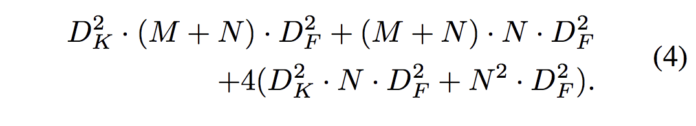

## Mobile Video Object Detection with Temporally-Aware Feature Maps

### 1. Abstract
  * Paper : https://arxiv.org/abs/1711.06368
  * Mobile 혹은 embedded device 환경에서 real-time video object dectection이 가능한 모델 제안
  * SSD(w Moblienet) [depthwise separable convolution](https://www.tensorflow.org/versions/master/api_docs/python/tf/nn/separable_conv2d) 적용, Bottleneck-LSTM을 통해 computation time을 현저히 줄임
### 2. Network architecture
  * **Overview**
    * 
    * 
    * Video를 Input image의 Seqeunece로 나타냄. 각 Time step마다 [SSD](https://arxiv.org/abs/1512.02325)이용하여 Image object detection을 하는 것이 기본 아이디어.
    * Image object detection의 결과를 결합하여, Video object detection을 수행하려는 과정
      * 본 논문의 경우 LSTM 구조를 feature level에 집어 넣음으로써, unified architecture로 Video object detection 을 수행하도록 디자인
      * Hidden state가 3-D tensor인 convolutional LSTM 사용
      * 유사하게 Video based task에 LSTM을 사용한 모델로 [LRCN](https://arxiv.org/abs/1411.4389), [ROLO](https://arxiv.org/pdf/1607.05781.pdf)등이 있음.
      * 본 논문에서 제시한 모델의 경우, LSTM layer가 network의 최종단계에서 postprocessing 역할을 수행하는 ROLO와 다르게, feature level에서 적용된다는 점에서 차별점이 있음
      * ROLO overview
      * 
  * **Integrating Convolutional LSTMs with SSD**
    * 단순히 전체 구조 중간중간에 LSTM layer를 집어 넣게되면, 연산량이 매우 증가해 real-time detector가 될 수 없음
    * SSD의 convolution 연산을 모두 depthwise separable convolution으로 변경
    * Bottleneck LSTM 구조 제안 (뒤에 설명)
  * **Feature Refinement with LSTMs**
    * 
    * M-layers LSTM + Single frame(Image) detector
    * Detector function G를 m+1개의 sub-networks로 나눈 뒤, 각 LSTM layer의 output에 순차적으로 적용
    * 논문에서는 Conv13 + SSD Feature map 4개 뒤에 LSTM을 위치시킨 model을 최종적으로 사용
  * **Extended Width Multiplier**
    * [MobileNet](https://arxiv.org/pdf/1704.04861.pdf) 논문에서 제시된 개념
    * Feature map의 parameter 수 M을 αM(α is hyperparameter, 0<=α<=1)로 제어
    * depthwise convolution시 depth방향 stride로 제어하는것으로 보임
    * MobileNet에서 모든 layer에 동일한 α값을 적용한 것과 달리 본 논문에서는, α_base, α_ssd, α_lstm 을 구분하여 지정
    * α_base=α, α_ssd=0.5α, α_lstm=0.25α 를 사용하였다고 함. α=[1,0.5] 에 대하여 실험.
  * **Efficient Bottleneck-LSTM layers**
    * Convolution LSTM? Hidden state와 Cell state의 형태가 H*W*N이고, gate 연산과정에, linear projection 대신 convolution 사용
    * Bottleneck-LSTM? 
      * 
      * Convolution LSTM의 연산량을 줄이기 위해 본 논문에서 제안하는 구조
      * Convolution LSTM의 4개 gate 연산 시, Hidden state와 Input을 channel 방향으로 concatenate한 H*W*(N+M) Tensor 대신, 해당 Tensor를 Bottleneck Layer에 통과시킨 H*W*N Tensor 사용
      * Bottleneck Layer는 아래식 참고
      * 
      * Bottleneck LSTM이(4번식), Standard LSTM(3번식), GRU와 비교해서도 매우 적은수의 연산량을 가짐
      * 
      * 
  * **Architecture**
    * 
    * 전체 layer 구조는 위와 같음 
### 3. Results
  * **Ablation Study**
    * Single LSTM Placement
      * 
      * LSTM layer를 각기 다른 위치에 하나만 위치 시키면서 실험
      * Conv13 layer뒤가 가장 효과적이 었다고함.
    * Recurrent Layer type
      * 
      * standard LSTM, GRU와 Bottleneck LSTM 과의 성능 비교 실험
      * Bottleneck LSTM이 compatible한 성능 유지하면서 현저히 적은 Param수, 연산 수를 가짐
    * Bottleneck Dimension
      * 
      * α_lstm을 구하기 위해 LSTM의 Output channel dimension에 따른 성능 변화 관찰
      * α_lstm=0.25α 지점 이후 성능하락 확인
    * Multiple LSTM Placement Strategies
      * 
      * Mutiple layers LSTM 성능 실험
      * 하나의 feature map에 대해 두 개 이상의 LSTM layer는 별로 의미가 없었다(Conv13 뒤에 두개 놓은 model)
      * Conv13 + SSD feature map 4개 뒤에 LSTM 위치 시킨 모델을 최종 모델로 사용
    * Comparison With Other Architectures
      * 
      * 타 모델과의 성능 비교
      * Mobilenet-SSD와 본 논문 제시 모델만이 real-time model
      * 그 중 모든 metric에서 본 논문 제시 모델이 뛰어났다
    * Robustness Evaluation
      * 
      * GT box 중 p 비율 만큼 날리고 Robustness test. LSTM쓴 본 논문이 robust함을 증명
    * Mobile Runtime
      * 
      * runtime 비교 실험
      * 논문 제시 모델이 가장 빨랐음
  * **Examples**
    * 
    * LSTM쓴 모델과 single frame model 비교
