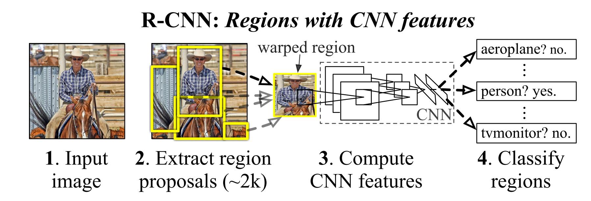
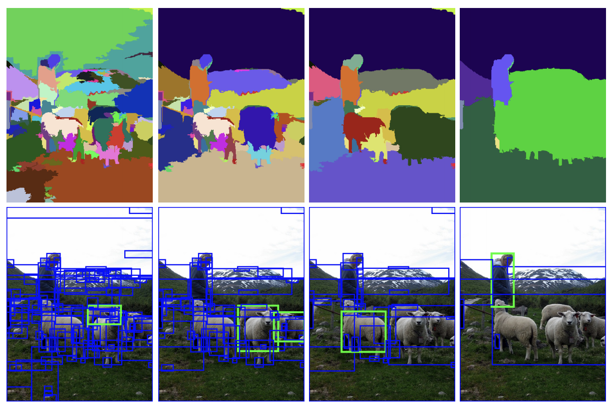
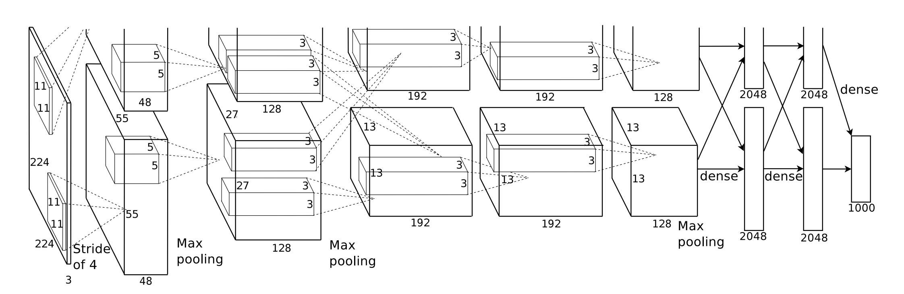
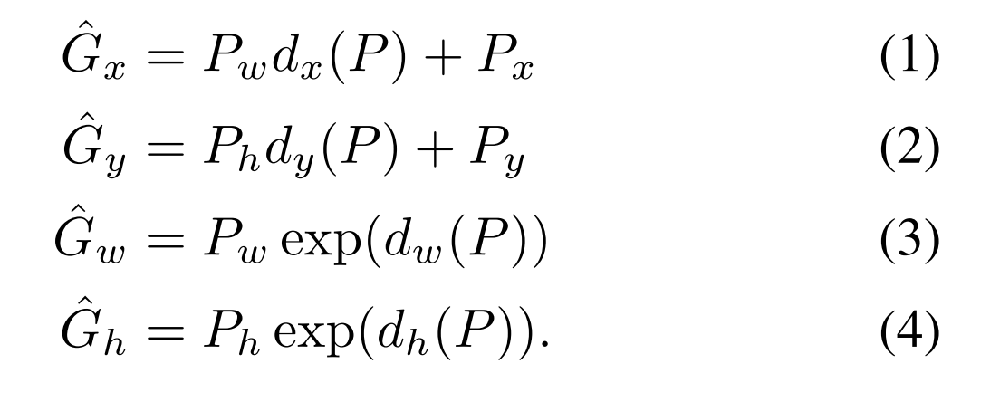
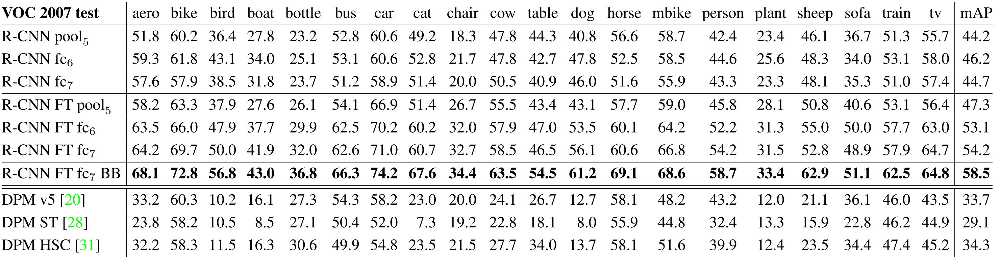
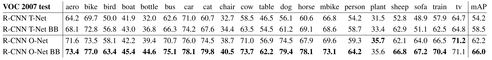

## Rich feature hierarchies for accurate object detection and semantic segmentation (R-CNN)

### 1. Abstract
  * Paper : https://arxiv.org/abs/1311.2524
  * 이전에는 SIFT, HOG feature를 이용하는 method가 주류
  * SVM에 밀렸던 CNN이 [Relu + Dropout를 더한 구조](https://papers.nips.cc/paper/4824-imagenet-classification-with-deep-convolutional-neural-networks.pdf)로 ImageNet(classification problem)에서 선전하자, Classification feature를 Detection에 사용하고자 함.
  
### 2. Network architecture
  * **Overview**
    * 
  * **Region proposals (Selective search)**
    * [Selective search](https://koen.me/research/pub/uijlings-ijcv2013-draft.pdf) 
    * 
    * Bottom-up 방식의 Object region proposal method
    * [Efficient Graph-Based Image Segmentation](https://www.cs.cornell.edu/~dph/papers/seg-ijcv.pdf)를 이용하여, region granularity를 찾은 뒤, greedy algorithm으로 hierarchical merge
    * Colour map(RGB,gray,HSV), merge하는 과정에서 사용하는 similarity measure(colour sim, texture sim, size sim)등을 여러 combination으로 사용해서, 다양한 region proposal을 만들어냄.
  * **Feature extraction(T-Net)**
    * [ImageNet Classification with Deep Convolutional Neural Networks](https://papers.nips.cc/paper/4824-imagenet-classification-with-deep-convolutional-neural-networks.pdf)
    * 
    * Curriculum learning
      * Pre-train on ImageNet : ImageNet(1000개 class)에 대한 classification task를 수행하도록 pre-train한 뒤, 마지막 dense layer 제거
      * Fine-tuning : VOC2007(20개 class) or ILSVRC2013(200개 class)에 대한 classification task를 수행하도록 fine tune. region proposal 중 GT와의 IoU가 0.5 이상인 box를 positive sample로, 이하인 box를 negative sample(background)로 사용.
  * **Object category classifiers(SVM)**
    * How to train
      * region proposal중 GT와의 IoU가 0.7이상인 box들을 positive sample로 이하인 box들을 negative sample로 사용 (fine tune때보다 tight한 조건)
    * CNN+FN+softmax Classifier(for fine-tune) VS SVM
      * 왜 fine tune시에 훈련한 Classifier를 Object category classifier로 사용하지 않는가?
        * SVM이 분류 성능이 더 좋았다! 이유는 tight한 조건으로 뽑아낸 training sample 덕분일 것으로 예상.
        * 그렇다면 fine tune시에도 동일한 조건으로 training sample을 만들면 되지 않나?
          * 우선 fine tune은 feature extractor에서, region proposal에 대한 좋은 feature를 뽑아내도록 하는 목적 (classification이 목적이아님)
          * tight하게 training sample을 뽑게 되면, data 숫자가 모자라서 fine tune 효과가 좋지 않았다.
          * 하지만 SVM의 경우 Deep한 CNN에 비해 비교적 적은 숫자의 data로도 훈련이 잘되기 때문에 이렇게 기준이 달라진 것.
          * 향후 연구에서 이 SVM은 대체가 된다
  * **Box regression**
    * Selective search에서 propose한 region + CNN feature를 이용하여 linear regression.
    * Region proposal --> Ground Truth로 fitting 시키는 linear regression model을 학습
    * Object detection scenario에서 성능이 더 좋아졌다.
    * 

### 3. Results
  * Objects detection
    * 
  * Detection average precision (%) on VOC 2007 test
    * 
  * Another feature extractor(O-Net)
    * 
