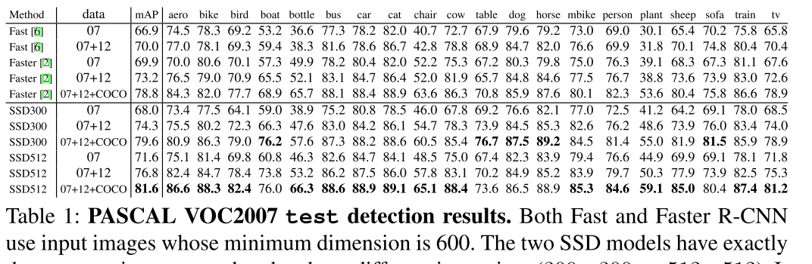

## SSD: Single Shot MultiBox Detector

### 1. Abstract
  * Paper : https://arxiv.org/abs/1512.02325
  * Object detection? detection 성능은 높지만 처리속도가 느린 R-CNN 계열(R-CNN,Fast R-CNN, Faster R-CNN)과 처리속도는 빠르지만 성능을 희생한 YOLO
  * SSD? Faster R-CNN에 준하는 detection 성능 + YOLO와 유사한 처리속도
  * Single Shot? 기존 R-CNN 계열의 Pipeline(Region proposal-Feature extration-Classification)과 달리, Single forward pass로 object detection 수행
  
### 2. Network architecture
  * **Overview**
    * 
    * VGG16을 ImageNet에 pre-train 시킨 뒤 classification layer 제거
    * VGG16 backbone 뒤에 Convolution layer를 쌓아올린 구조. Feature map size가 점차 줄어듦.
    
  * **Multi-scale feature maps for detection**
    * YOLO, Overfeat이 single scale feature map을 사용하는 것과 달리, 여러개 layer에서 다양한 size의 feature map 사용
    * backbone 뒤 쌓아올린 convolution layer와 Backbone에 속하는 convolution layer에서 추출한 feature map 사용
    
  * **Convolutional predictors for detection**
    * 다양한 size의 feature map을 각각의 classifier(CNN based)에 태워줌
    * classifier는 feature map의 각 cell마다 category score(c개의 class에 대한 확률분포)와 shape offset(cx, cy, width, heigth)을 생성
    
  * **Default boxes and aspect ratios**
    * 
    * default box? 정답이 될 수 있는 box의 모양을 미리 정의
    * 예측 가능한 box 의 space를 줄이기 위해 default box라는 개념 차용. 정답을 객관식으로 만들어줬다고 생각하면 쉬움
    * Faster R-CNN의 Anchor box와 유사. 
    * Diffrent default box(Shape) + Multi scale feature map(Scale) --> 다양한 모양과 크기의 bounding box 생성
    
### 3. Training
  * **Matching strategy**
    * 각각의 default box에 대하여 loss를 계산할 gt box set 선택
    * [MultiBox](https://pdfs.semanticscholar.org/0674/792f5edac72b77fb1297572c15b153576418.pdf) 참조
    * 모든 feature map의 모든 location에 대한 default box에 대하여, jaccard overlap이 threshold(0.5) 이상인 모든 gt box에 대하여 loss 계산
  * **Training objective**
    * 
    * 
    * 
  * **Hard negative mining**
    * Box match 하고나면 Negative box가 압도적으로 많음
    * 각 default box shpae별로 conf loss 내림차순으로 sort하고 top one pick. 
    * Negative:Positive 비율을 최대 3:1로 제한
    
### 3. Results
  * **Objects detection(VOC2007)**
    * 
  * **mAP & FPS(FasterRCNN vs YOLO vs SSD)**
    * 
  * **Detection results**
    * 
